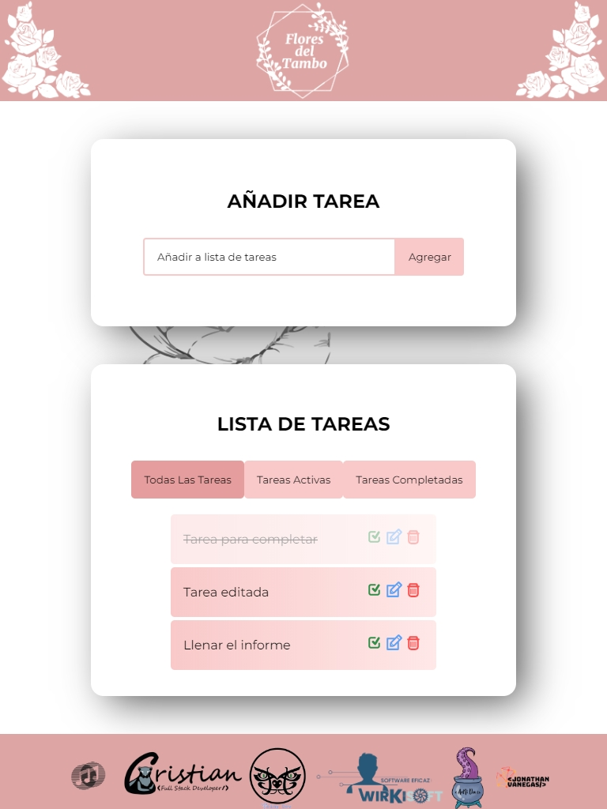
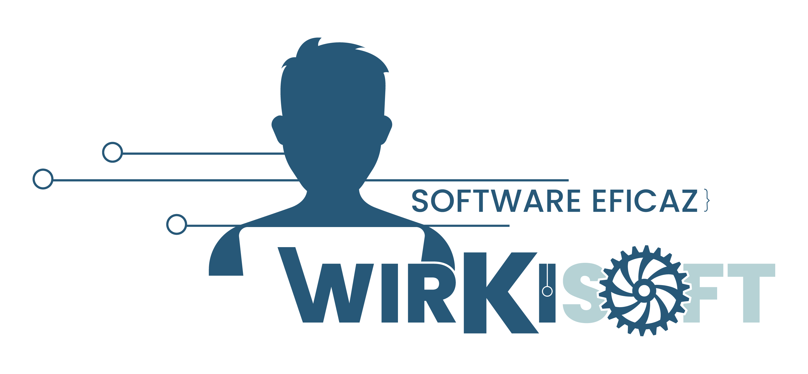
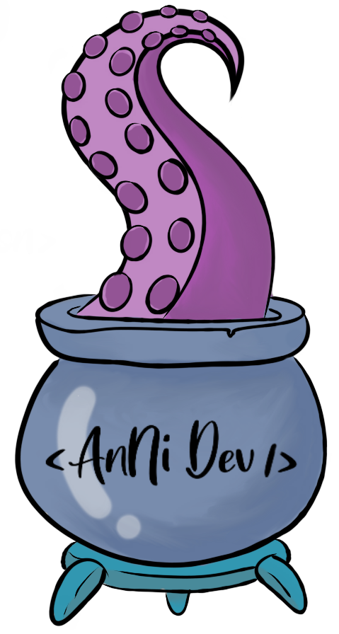
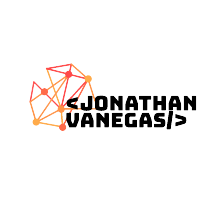

<div align="center">
  <h1 align="center">Todo List Flores del Tambo</h1>
  <a href="https://todolist-tambo-flowers-front.vercel.app/">
    
  </a>
</div>

## Sobre el Proyecto

Aplicación web para poder gestionar las tareas de manera rápida, y que estas queden almacenadas en una base de datos para verificar cuáles se han completado o siguen activas.

### Características del Proyecto

- Agregar tareas
- Editar tareas
- Eliminar tareas
- Completar tareas
- Filtrar Tareas completas y activas

### Tecnologías de Desarrollo

Esta aplicación fue desarrollada con el Stack MERN y haciendo uso de la librería Redux para los estados de la aplicación:


## Instalación 

Estas instrucciones te permitirán obtener una copia del proyecto en funcionamiento en tu equipo local para propósitos de desarrollo y pruebas.

1. Clonar el repositorio

   ```sh
   git clone https://github.com/Nisanech/todolist-tambo-flowers.git
   ```
   
2. Ingresar a la carpeta `backend` y `fronted`

3. Instalar dependencias de NPM

   ```sh
   npm install
   ```
   
4. Crear el archivo `.env` para las variables de entorno para la conexión de la base de datos en MongoDB Atlas. No olvides reemplazar los valores de `<User>`, `<Password>`, `<CollectionName>`, `<DataBaseName>` 

   ```js
   MONGODB_URL=`mongodb+srv://<User>:<Password>@<CollectionName>.czru9rw.mongodb.net/<DataBaseName>?retryWrites=true&w=majority`
   ```

5. En el archivo `index.js` ubicado en la ruta `frontend/src/redux/actions/index.js` descomentar la línea #15 para habilitar la ruta local del proyecto.
<!-- USAGE EXAMPLES -->

## Iniciar los servidores

1. Ingresar a la carpeta backend
    
   ```sh
   npm run dev
   ```

2. Ingresar a la carpeta frontend
  
   ```sh
   npm start
   ```

## Despliegue de la Aplicación

https://todolist-tambo-flowers-front.vercel.app/

## Equipo de Desarrollo

<p align="left"> <a href="https://github.com/Nisanech" target="_blank"> </a> <a href="https://github.com/Andrea-25-11" target="_blank"> </a> <a href="https://github.com/EdwardMelo1" target="_blank"> </a> <a href="https://github.com/Jonathanvg97" target="_blank"> </a> <a href="https://github.com/CrisCaBeRi" target="_blank"> </a> <a href="https://github.com/Juliana1497" target="_blank"> </a></p>
